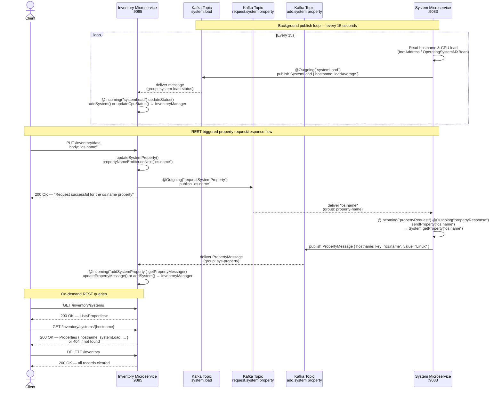

# Microservice Interaction Sequence Diagram

## Overview

This guide extends basic reactive messaging with a **bidirectional** event-driven flow triggered by a REST endpoint:

- **Event-driven (one-way):** System Microservice → Kafka (`system.load`) → Inventory Microservice
- **Event-driven (request/response):** Client → Inventory REST → Kafka (`request.system.property`) → System Microservice → Kafka (`add.system.property`) → Inventory Microservice
- **RESTful API:** Client → Inventory Microservice

## Services

| Service                | Port | Role                                                                                                       |
| ---------------------- | ---- | ---------------------------------------------------------------------------------------------------------- |
| System Microservice    | 9083 | Publishes CPU load metrics every 15 s; processes property requests from Kafka and publishes responses back |
| Inventory Microservice | 9085 | Consumes CPU load and property response messages from Kafka; exposes REST endpoints including `PUT /data`  |

## Kafka Topics

| Topic                     | Producer               | Consumer               | Payload                  |
| ------------------------- | ---------------------- | ---------------------- | ------------------------ |
| `system.load`             | System Microservice    | Inventory Microservice | `SystemLoad` (JSON)      |
| `request.system.property` | Inventory Microservice | System Microservice    | `String` (key name)      |
| `add.system.property`     | System Microservice    | Inventory Microservice | `PropertyMessage` (JSON) |

---

## Sequence Diagram



---

## Key Design Details

### Flow 1 — System → Inventory (periodic system load)

- `SystemService.sendSystemLoad()` is annotated `@Outgoing("systemLoad")` and returns a `Publisher<SystemLoad>` driven by `Flowable.interval(15, TimeUnit.SECONDS)`. The runtime subscribes and routes each emission to the `liberty-kafka` connector.
- `InventoryResource.updateStatus()` is annotated `@Incoming("systemLoad")`. The runtime calls it for each deserialized `SystemLoad` message — no polling or offset management in application code.

### Flow 2 — REST-triggered property request/response

The request leg is bridged from REST to reactive messaging via a `FlowableEmitter`:

```
PUT /inventory/data "os.name"
        │
        ▼
updateSystemProperty() ── propertyNameEmitter.onNext("os.name")
        │
        ▼
sendPropertyName() ── @Outgoing("requestSystemProperty")
        │  Flowable.create(BackpressureStrategy.BUFFER)
        │
        ▼
Kafka: request.system.property topic
```

The System Microservice processes the request as a **processor** (single method with both `@Incoming` and `@Outgoing`):

```
Kafka: request.system.property
        │
        ▼
sendProperty(propertyName) ── @Incoming("propertyRequest") @Outgoing("propertyResponse")
        │  System.getProperty("os.name") → PropertyMessage { hostname, key, value }
        │
        ▼
Kafka: add.system.property topic
        │
        ▼
getPropertyMessage(pm) ── @Incoming("addSystemProperty")
        │  InventoryManager.updatePropertyMessage()
```

### Channel → Kafka Topic Binding

```
Inventory Microservice                          System Microservice
@Outgoing("requestSystemProperty")         @Incoming("propertyRequest")
        |                                          |
        | mp.messaging.outgoing                    | mp.messaging.incoming
        |   .requestSystemProperty                 |   .propertyRequest
        |   .topic=request.system.property         |   .topic=request.system.property
        \____________________ [Kafka: request.system.property] ______________________/

@Incoming("addSystemProperty")             @Outgoing("propertyResponse")
        |                                          |
        | mp.messaging.incoming                    | mp.messaging.outgoing
        |   .addSystemProperty                     |   .propertyResponse
        |   .topic=add.system.property             |   .topic=add.system.property
        \____________________ [Kafka: add.system.property] _______________________/
```

Note: the logical channel names differ between services (`requestSystemProperty` vs `propertyRequest`); only the physical topic name must match.

### Data Models

```
SystemLoad
├── hostname:     String   (e.g. "system-host-abc")
└── loadAverage:  Double   (-1.0 if OS does not support measurement)

PropertyMessage
├── hostname:  String   (which system reported the value)
├── key:       String   (the JVM property name, e.g. "os.name")
└── value:     String   (the resolved System.getProperty() value, e.g. "Linux")
```

### Inventory Storage

- `InventoryManager` wraps a `TreeMap<String, Properties>` with `Collections.synchronizedMap` to handle concurrent writes from two `@Incoming` listeners and concurrent reads from REST handlers.
- `addSystem(hostname, systemLoad)` creates an entry keyed by hostname with the CPU load.
- `addSystem(hostname, key, value)` creates an entry with a property key/value pair.
- `updateCpuStatus()` and `updatePropertyMessage()` update existing entries without overwriting other fields.
- `TreeMap` keeps hostnames in lexicographic order, making REST list responses deterministic.
